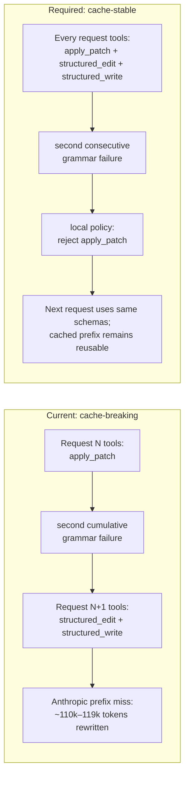

# Opus 5 Prompt-Cache Stability During Edit-Protocol Fallback

Status: Proposed remediation specification
Date: 2026-07-26 UTC
Repository baseline: `67aa0522d76224e6b9b94daf52086c54a12df5d5`
Primary owner: `codex-core` tool planning and edit-protocol maintainers
Incident class: Model-visible tool-schema mutation invalidates a provider-cached
conversation prefix
Severity: P1 cost regression; P2 latency and provider-pressure risk
Target release: first PFTerminal release after implementation and qualification

## 1. Executive decision

PFTerminal must keep the model-visible tool inventory and each tool's serialized
schema byte-stable for the duration of a turn.

The edit-protocol fallback may change local dispatch policy and append ordinary tool
feedback to conversation history. It must not add, remove, reorder, rename, or
rewrite model-visible tools after inference has started.

For a turn that begins with strict `apply_patch` and is eligible to fall back:

- `apply_patch`, `structured_edit`, and `structured_write` must be registered in the
  first model request and remain registered in the same order with identical schemas;
- strict patch parsing remains the preferred editing protocol initially;
- after two **consecutive grammar failures**, PFTerminal keeps the same tool schema
  but rejects further `apply_patch` calls locally and tells the model to use the
  structured tools;
- a successfully parsed strict patch resets the grammar-failure streak before the
  fallback threshold is reached.

This is a general cache-boundary repair. It must not special-case the benchmark
prompt, Opus 5, website generation, particular filenames, or literal error text from
the incident.

### 1.1 Before and after



“Turn” in this spec means one core user turn from accepted user input through its
single `TurnComplete`, including every internal sampling/tool continuation. Stability
is mandatory for that lifetime. Across separate user turns, the inventory should
also remain identical when immutable session capabilities are unchanged, but a
permission, feature, environment, or model change may legitimately produce a new
inventory and cache key.

## 2. Why this work is required

The 2026-07-26 Opus 5 website bake-off ran three matched PFTerminal and Claude Code
waves. Both contestants used direct Anthropic `claude-opus-5`, dedicated API keys,
fresh workspaces, and the same website task. All six final sites passed the
independent functional verifier.

PFTerminal remained 11.376% faster across the campaign, but its Anthropic contestant
cost was 12.496% higher:

| Campaign total | PFTerminal | Claude Code | PFTerminal delta |
|---|---:|---:|---:|
| Wall time | 2,871.687s | 3,240.303s | −368.616s |
| Opus cost | $15.4337685 | $13.7194425 | +$1.7143260 |

The cost reversal was not an API-key or billing-attribution error. Anthropic Admin
Usage was grouped by dedicated key ID, initial and settled snapshots were identical,
and Claude Code's client totals reconciled exactly to its Admin total.

Detailed log reconstruction found one full prompt-cache break in PFTerminal wave 2
and one in wave 3. Both occurred on the first `structured_edit` request immediately
after a second malformed `apply_patch` enabled the dynamic fallback.

The two full misses rewrote approximately 228,713 input tokens into the five-minute
cache:

```text
118,536 + 110,177 = 228,713 tokens
228,713 × $6.25 per million = approximately $1.42946
```

Those two events account for 87.9% of PFTerminal's excess cache-creation tokens over
Claude Code in waves 2–3. The defect is therefore economically material and directly
supported by provider billing plus per-call session logs.

The attribution denominator is explicit:

```text
PFTerminal cache creation       516,656
Claude Code cache creation    − 256,500
                               -------
PFTerminal excess               260,156

full-miss input                 228,713
228,713 / 260,156 × 100          87.91%
```

## 3. Incident artifacts and integrity

Local benchmark run root at incident capture time:

```text
/home/pfrpc/repos/pfterminal-perf-probe/runs/opus5-visual-site-20260726T011738Z
```

Primary investigation:

```text
../pfterminal-perf-probe/runs/opus5-visual-site-20260726T011738Z/cache_break_investigation.md
SHA-256 21d93d5403ffe1b5d6e3234799a8363e281736edf696fdc6bf2c3d6533b9bba0
```

Settled Anthropic usage summary:

```text
../pfterminal-perf-probe/runs/opus5-visual-site-20260726T011738Z/admin_usage/waves23_settled.summary.json
SHA-256 45bac3d9a148c0537ac0f04d2d8f52549b43f803e09b403142250dace357dbc2
```

PFTerminal stdout evidence:

```text
results/pft/wave2/pfterminal.stdout
SHA-256 738d01dd0790374cac5628241a30b48875d61570cefb18c8aaf58ed55d2e3111

results/pft/wave3/pfterminal.stdout
SHA-256 69966d5869f6ae584a6eecdb7a67192e093b05b488240915861efee9e4a92cd4
```

The relative `results/...` paths above are beneath the benchmark run root.
The SHA-256 values make the evidence verifiable after copying it to another machine;
the `/home/pfrpc` path itself is not a portable product dependency.

Dedicated key attribution:

| Lane | Anthropic key ID | Waves 2–3 settled cost |
|---|---|---:|
| PFTerminal | `apikey_01ETPF8aNWXS17BDVpWkzPQD` | $10.647866 |
| Claude Code | `apikey_01SkUWKM1VvMXAt2CR4H3Mk6` | $9.509051 |
| Excluded concurrent traffic | `apikey_01FFAau6V4hVFuycmEoXmRKp` | not attributed |

Key IDs are non-secret billing identifiers. No raw credentials belong in this spec,
tests, fixtures, logs, snapshots, or commits.

## 4. Reconstructed failure sequence

### 4.1 Wave 2

| UTC timestamp | Event | Input | Cached input | Hit rate |
|---|---|---:|---:|---:|
| 02:09:29.961 | successful `apply_patch` call | 114,601 | 112,439 | 98.11% |
| 02:09:40.452 | malformed `apply_patch`; cumulative failure becomes 2 | 116,832 | 114,599 | 98.08% |
| 02:09:46.116 | first `structured_edit` after tool-plan replacement | 118,536 | 0 | **0.00%** |
| 02:09:50.113 | second `structured_edit` | 118,691 | 118,534 | 99.86% |

The failed patch omitted the required `*** Begin Patch` line. PFTerminal then emitted:

```text
Repeated apply_patch grammar failures detected (2). The next tool plan will switch
this turn to structured_edit for existing files and structured_write for new/full-file
writes; do not retry apply_patch.
```

PFTerminal's next-request warning recorded that the previous large request had
`cached_input=0/118536`.

### 4.2 Wave 3

| UTC timestamp | Event | Input | Cached input | Hit rate |
|---|---|---:|---:|---:|
| 02:26:06.936 | successful `view_image` continuation | 106,748 | 106,318 | 99.60% |
| 02:26:23.438 | empty `apply_patch` hunk; cumulative failure becomes 2 | 108,756 | 106,746 | 98.15% |
| 02:26:32.274 | first `structured_edit` after tool-plan replacement | 110,177 | 0 | **0.00%** |
| 02:26:42.719 | second `structured_edit` | 110,790 | 110,175 | 99.44% |

PFTerminal's next-request warning recorded that the previous large request had
`cached_input=0/110177`.

### 4.3 Evidence against alternative explanations

- The cache was healthy 6–9 seconds before each miss; five-minute TTL expiration
  cannot explain the transition.
- The cache was healthy again on the immediately following request; the provider and
  key remained usable.
- Both misses align exactly with the first request after the edit-tool inventory
  changed.
- Wave 1 did not enter this fallback and had no large zero-cache request.
- Claude Code waves 2 and 3 had no equivalent large request with zero cache reads.
- Anthropic initial and settled usage snapshots were identical.

## 5. Current code path and failed boundary

### 5.1 Failure state is cumulative

In `codex-rs/core/src/session/turn_context.rs`,
`ModelEditProtocolState` (baseline lines 43–51) contains:

```rust
strict_apply_patch_failures: AtomicU8,
structured_edit_fallback_enabled: AtomicBool,
```

`TurnContext::record_strict_apply_patch_failure()` (baseline lines 233–245)
increments the counter and
permanently enables fallback when it reaches two.

Repository search at baseline commit `67aa0522...` finds no method that resets
`strict_apply_patch_failures`. Consequently, failures need not be consecutive:

- wave 2 failures were approximately 8 minutes apart;
- wave 3 failures were approximately 10 minutes apart;
- successful patches and other productive tool calls occurred between them.

### 5.2 Both malformed-patch entry paths mutate the same turn state

`ApplyPatchHandler::handle_call()` in
`codex-rs/core/src/tools/handlers/apply_patch.rs` records the failure and announces
a future tool-plan switch in both relevant parse paths:

- freeform strict parser: lines 378–405;
- shell-intercept parser: lines 520–545.

Correctness, permission, filesystem, and runtime failures are separate failure
classes and must not become grammar-streak increments in the remediation.

### 5.3 Mutable fallback state replaces model-visible tools

`structured_edit_protocol_enabled()` in
`codex-rs/core/src/tools/handlers/structured_edit.rs` (baseline lines 82–93)
returns `true` when the
mutable fallback flag is enabled.

`add_core_utility_tools()` in `codex-rs/core/src/tools/spec_plan.rs` (baseline lines
753–767) then chooses one of two mutually exclusive inventories:

```text
fallback disabled: apply_patch
fallback enabled:  structured_edit + structured_write
```

The tool plan is rebuilt for subsequent inference requests, so a mutable runtime
state changes the serialized prompt prefix.

### 5.4 Anthropic explicitly caches the serialized tools

`build_anthropic_messages_request_with_history_repair()` in
`codex-rs/core/src/client.rs` (baseline lines 1479–1529) serializes `prompt.tools`.

`create_tools_json_for_anthropic_messages()` in the same file (baseline lines
3862–3877) converts and orders the tools, then
`mark_last_anthropic_tool_cache_control()` (baseline lines 3879–3894) places explicit
cache control on the last eligible tool.

Replacing the tool list changes an early cache-keyed prefix and invalidates the
subsequent conversation cache. The zero-cache provider usage demonstrates the
result.

### 5.5 Existing regression coverage preserves the costly behavior

The repeated-failure integration test in
`codex-rs/core/tests/suite/tool_harness.rs` (baseline lines 920–972) currently
requires:

- request two contains `apply_patch` and not `structured_edit`;
- request three contains `structured_edit` and `structured_write`;
- request three does not contain `apply_patch`.

That test verifies fallback availability but encodes a model-visible schema mutation.
It must be rewritten, not supplemented with a contradictory test.

## 6. Scope

### 6.1 In scope

- Stable model-visible edit-tool inventory within one turn.
- Consecutive grammar-failure semantics.
- Local enforcement after fallback activation.
- Both freeform and shell-intercept `apply_patch` paths.
- Anthropic request-body stability coverage.
- Existing native-structured providers such as Z.AI, Ambient, Meta, and model slugs
  already selected by `structured_edit_protocol_enabled()`.
- Metrics needed to verify fallback activation without relying on billing.
- A bounded direct-Anthropic qualification probe after deterministic tests pass.

### 6.2 Out of scope

- Changing Anthropic prices, TTLs, or API behavior.
- Retrofitting one-hour cache TTL as a substitute for schema stability.
- Rewriting generated benchmark sites or changing judge outcomes.
- Altering unrelated provider routing, authentication, or database migrations.
- Changing the public app-server protocol.
- Adding a user-facing configuration flag for an internal correctness repair.
- Broad edit-tool redesign beyond the fallback/cache boundary.

## 7. Required invariants

### 7.1 Tool-schema invariants

For every inference request in one turn:

1. The ordered model-visible tool names are identical.
2. Each tool's serialized JSON schema is identical.
3. Cache-control placement inside the tool array is identical.
4. Mutable execution policy does not participate in tool specification generation.
5. Deferred tools may only become callable through mechanisms that preserve the
   provider's existing cache contract; edit fallback may not use deferred discovery.

The required tests must assert both:

- deep equality of the complete `tools` values, to produce useful structural diffs;
- byte equality of `serde_json::to_vec(&request.tools)` using the production
  serializer, to catch key-order or serialization drift hidden by parsed equality.

Name-only assertions are insufficient.

### 7.2 Failure-streak invariants

- Only strict patch grammar/parse failures increment the streak.
- A successfully parsed strict patch resets the streak to zero, even if later
  correctness verification, permissions, or execution fails.
- Unsupported payloads, unavailable environments, correctness failures, sandbox
  denials, and filesystem conflicts do not increment the grammar streak.
- Two grammar failures with a successfully parsed patch between them do not activate
  fallback.
- Two consecutive grammar failures activate fallback exactly once.
- Saturation and concurrency must not wrap the counter or emit duplicate transition
  metrics.
- Concurrent parse outcomes are ordered by one documented linearization point. A
  success linearized between two failures resets the streak; two failures linearized
  without an intervening success activate fallback.

### 7.3 Fallback behavior invariants

After fallback activates:

- `apply_patch` remains present with its original schema.
- A subsequent `apply_patch` invocation is rejected before parsing or filesystem
  mutation.
- The tool result says that strict patch editing is disabled for the remainder of
  the turn and directs the model to `structured_edit` or `structured_write`.
- `structured_edit` and `structured_write` execute normally.
- Existing tool calls already in flight are not cancelled or reinterpreted.
- No extra inference request is introduced solely to announce fallback.
- The visible transcript and rollout remain append-only; no history rewrite is
  permitted.

### 7.4 Native structured-edit invariants

Providers/models that begin a turn in native structured-edit mode must preserve their
current behavior:

- structured tools remain available;
- strict `apply_patch` need not be exposed when it was never the selected protocol;
- the inventory must still remain stable for the turn;
- Z.AI/GLM, Ambient, and Meta routing tests must remain green.

## 8. Detailed design

### 8.1 Separate immutable availability from mutable policy

Split the current overloaded meaning of `structured_edit_protocol_enabled()`:

```rust
enum EditProtocolMode {
    NativeStructured,
    StrictPatchWithStructuredFallback,
}
```

The exact type name may differ, but the two questions must be separate:

1. **Immutable availability:** which tool schemas are registered for this turn?
2. **Mutable policy:** which registered edit tool is currently accepted/preferred?

`spec_plan.rs` may consult immutable turn/provider/model capabilities. It must not
consult `structured_edit_fallback_enabled()` when constructing model-visible specs.

For `StrictPatchWithStructuredFallback`, register all three edit handlers once:

```text
apply_patch
structured_edit
structured_write
```

For `NativeStructured`, preserve the existing structured-only inventory.

### 8.2 Make the fallback counter a consecutive grammar streak

Replace the counter plus separate boolean with one linearizable atomic state. One
per-turn `AtomicU8` is sufficient:

```text
0 = no grammar failures
1 = one consecutive grammar failure
2 = fallback active (absorbing state)
```

Do not retain independent counter and activation atomics; they permit observers to
see combinations that do not describe one state-machine transition.

Expose methods whose call sites are explicit:

```rust
fn record_strict_apply_patch_grammar_failure(&self) -> PatchFallbackTransition;
fn record_strict_apply_patch_parse_success(&self);
```

Prefer an enum over an ambiguous boolean:

```rust
enum PatchFallbackTransition {
    Unchanged { consecutive_failures: u8 },
    Activated { consecutive_failures: u8 },
}
```

Required behavior:

- both methods use a compare/exchange loop (or an equivalently linearizable critical
  section) over the single state;
- the successful compare/exchange is the transition's linearization point;
- `record_strict_apply_patch_parse_success()` maps `0|1 -> 0` and `2 -> 2`;
- a failure maps `0 -> 1`, `1 -> 2`, and `2 -> 2`;
- only the caller that commits `1 -> 2` observes `Activated`;
- once active, fallback remains active until the turn ends;
- a new turn starts with the default state.

Do not add a public API or persist this transient state to the local database.

Parallel edit calls are admitted or rejected from the policy state observed at
handler entry. An invocation admitted before `1 -> 2` may finish normally; activation
does not cancel it. An invocation entering after `1 -> 2` is rejected locally.
Concurrent grammar outcomes are “consecutive” in compare/exchange linearization
order. That order is linearizable, although which contender wins is not
deterministic when calls overlap.

### 8.3 Reset at the grammar boundary, not after filesystem success

Call `record_strict_apply_patch_parse_success()` immediately after the strict parser
recognizes a valid patch:

- after `codex_apply_patch::parse_patch()` returns `Ok(args)` in the freeform handler;
- after the shell-intercept path recognizes a syntactically valid apply-patch body.

This is intentionally earlier than correctness verification or filesystem execution.
The streak describes model grammar compatibility, not whether a valid patch happened
to apply cleanly.

### 8.4 Enforce fallback locally without schema mutation

At the start of `ApplyPatchHandler::handle_call()`:

1. inspect the mutable fallback policy;
2. if active, return `FunctionCallError::RespondToModel` with bounded deterministic
   guidance;
3. do not parse, verify, request permissions, emit filesystem deltas, or execute.

The tool stays visible solely to preserve the cached schema. Local rejection is the
policy boundary.

The guidance must describe the general protocol and may include tool names. It must
not include benchmark wording, provider names, costs, or filenames.

### 8.5 Preserve deterministic tool serialization

The initial implementation must demonstrate that:

- handler registration order is deterministic;
- `create_tools_json_for_anthropic_messages()` produces deep-equal arrays before and
  after fallback;
- the cache-control marker remains on the same tool at the same array index;
- no dynamic description text includes the current fallback state.

The request-construction test must serialize each `AnthropicMessagesRequest` with the
same production `serde_json` path used by the client and compare the exact serialized
`tools` bytes. Parsed JSON equality alone is not the release gate.

Do not “fix” the incident by removing Anthropic cache-control markers. That would
discard prompt-cache savings for every request.

### 8.6 Telemetry

Retain existing `model_edit_compat` metrics and add or refine transition attributes
so operators can distinguish:

```text
protocol=strict_apply_patch
event=fallback_activated
reason=consecutive_grammar_failures
consecutive_failures=2
tool_schema_changed=false
```

If a tool-schema fingerprint already exists in request telemetry, record its stable
hash before and after activation. Otherwise, add a bounded internal fingerprint of
the serialized model-visible tools without logging the schemas themselves.

Never log tool arguments, file contents, API keys, or full request bodies for this
metric.

### 8.7 Alternatives considered

| Alternative | Decision | Reason |
|---|---|---|
| Pre-register all three existing edit tools and switch local policy | **Chosen** | Smallest change that preserves current tool APIs, rollouts, and cache-keyed schemas |
| One immutable `edit` gateway with a local strict/structured dispatcher | Reserve as fallback design | Strong cache boundary, but materially larger tool API and model-behavior change |
| Reset the failure counter but retain dynamic tool replacement | Rejected | Reduces frequency but every eventual fallback still invalidates the full prefix |
| Use a one-hour Anthropic TTL | Rejected | A changed tool prefix misses regardless of TTL and one-hour writes cost more |
| Remove explicit tool cache control | Rejected | Eliminates the savings being protected and raises cost on every later request |
| Compact or start a fresh thread at fallback | Rejected | Disrupts the user workflow and hides rather than repairs the schema boundary |

### 8.8 Effort and change budget

Expected implementation effort:

| Work | Estimate |
|---|---:|
| State machine and handler enforcement | 0.5 engineering day |
| Stable tool planning and request-byte tests | 0.5–1 engineering day |
| Provider regression tests and scoped cleanup | 0.5 engineering day |
| Bounded live qualification and evidence report | 0.5 engineering day plus provider settlement |
| Three-wave economic requalification | approximately 1 hour wall time plus declared API spend |

Target fewer than 500 non-mechanical changed lines. If stable tool planning requires a
broader tool API refactor, split that refactor from the behavior change and rescore
the risk before implementation.

## 9. Implementation worklist

### 9.1 State semantics

- [ ] Rename the counter to communicate that it is a consecutive grammar-failure
      streak.
- [ ] Add an explicit parse-success reset method.
- [ ] Return a transition enum that distinguishes ordinary increments from first
      activation.
- [ ] Make activation idempotent under concurrent observation.
- [ ] Keep fallback state turn-local and non-persistent.
- [ ] Add focused unit coverage for state transitions if integration coverage cannot
      express atomic edge cases without test-only production APIs.

### 9.2 Stable tool planning

- [ ] Split immutable structured-tool availability from mutable fallback activation.
- [ ] Update `spec_plan.rs` so mutable fallback state never adds or removes
      model-visible tools.
- [ ] Register all three edit handlers at turn start for strict-patch sessions that
      support structured fallback.
- [ ] Preserve structured-only inventory for native structured-edit providers.
- [ ] Confirm stable registration order across every request in a turn.
- [ ] Remove or rewrite comments that describe the old “next tool plan will switch”
      behavior.

### 9.3 Handler enforcement

- [ ] Reset the grammar-failure streak after valid freeform patch parsing.
- [ ] Reset the grammar-failure streak after valid shell-intercept patch parsing.
- [ ] Do not reset or increment the streak for correctness, permission, sandbox,
      filesystem, or runtime outcomes.
- [ ] Reject `apply_patch` locally once fallback is active.
- [ ] Ensure rejected calls cannot emit partial filesystem deltas.
- [ ] Keep fallback guidance bounded and provider-agnostic.
- [ ] Preserve execution of `structured_edit` and `structured_write`.

### 9.4 Regression tests

- [ ] Rewrite the existing repeated-failure integration test in
      `core/tests/suite/tool_harness.rs`.
- [ ] Assert parsed equality and production-serialized byte equality of the complete
      model-visible `tools` arrays before and after fallback.
- [ ] Assert that `apply_patch`, `structured_edit`, and `structured_write` are present
      from request one in fallback-capable strict mode.
- [ ] Assert failure → valid patch → failure does not activate fallback.
- [ ] Assert valid grammar followed by a correctness error still resets the grammar
      streak.
- [ ] Assert two consecutive malformed patches activate fallback exactly once.
- [ ] Assert `apply_patch` remains visible but is locally rejected after activation.
- [ ] Assert structured editing succeeds after activation.
- [ ] Cover both freeform and shell-intercept malformed-patch paths.
- [ ] Preserve native structured-edit provider tests for Z.AI/GLM, Ambient, and Meta.
- [ ] Add an Anthropic request-body regression that compares serialized tool arrays,
      including cache-control placement.
- [ ] Assert no request contains raw credentials or newly introduced unbounded
      diagnostics.

### 9.5 Metrics and operations

- [ ] Emit exactly one fallback-activation metric per turn.
- [ ] Record `tool_schema_changed=false` or a stable non-secret schema fingerprint.
- [ ] Preserve the existing provider cache-pressure warning.
- [ ] Document the metric fields in code next to their owner; do not add general
      product documentation under `docs/`.

### 9.6 Qualification

- [ ] Run the targeted `codex-core` integration tests through `just test`, never
      direct `cargo test`.
- [ ] Run `just test -p codex-core`.
- [ ] Request approval before the repository-wide `just test`, as required by
      `AGENTS.md`, then run it if approved.
- [ ] Run `just fix -p codex-core` after tests.
- [ ] Run `just fmt` automatically after code changes.
- [ ] Run the deterministic request-body cache-stability probe in Section 10.2.
- [ ] Measure the added first-request tool-schema tokens on at least one supported
      provider/model without prompt caching and record the result.
- [ ] Run one bounded direct-Anthropic qualification in Section 10.3 with an isolated
      key and recorded spend window.
- [ ] Re-run at least three matched benchmark waves before making a product-level
      cost claim.
- [ ] Attach test output, request fingerprints, Admin Usage snapshots, and comparison
      arithmetic to the implementation report.

## 10. Acceptance tests and release gates

### 10.1 Deterministic integration gate

Construct a `test_codex` sequence that:

1. starts a fallback-capable strict-patch turn;
2. captures request 1;
3. returns one malformed patch;
4. returns one valid patch;
5. returns another malformed patch and proves fallback is still inactive;
6. returns a second consecutive malformed patch;
7. proves fallback activates;
8. attempts `apply_patch` and observes local rejection;
9. completes a `structured_edit`;
10. captures every outbound request.

Pass conditions:

- every request's parsed `tools` value is equal;
- `serde_json::to_vec(&request.tools)` is byte-identical for every request when
  produced by the production request serializer;
- fallback activates only after the final two consecutive failures;
- no rejected strict patch mutates the filesystem;
- the structured edit produces the expected final file object;
- exactly one fallback transition metric is emitted;
- the turn completes without an extra provider request used only for fallback.

### 10.2 Anthropic request-construction gate

Using the Anthropic Messages request builder without paid inference:

1. serialize a request before fallback;
2. activate fallback in the turn policy;
3. serialize the next request with appended history;
4. compare `/tools` in both JSON bodies.

Pass conditions:

```text
before.tools == after.tools
serialize_production(before.tools) byte-equals serialize_production(after.tools)
before tools cache-control index == after tools cache-control index
before tool-schema fingerprint == after tool-schema fingerprint
```

The messages are expected to grow append-only and are not expected to be equal.

### 10.3 Bounded live-cache qualification

Only after deterministic tests pass:

1. use a dedicated Anthropic key with no concurrent traffic;
2. create a synthetic tool-heavy turn with at least 30,000 cached input tokens;
3. record a healthy cache hit;
4. trigger two consecutive malformed patch calls;
5. complete one structured edit;
6. capture per-call usage and Admin Usage after settlement;
7. stop after one qualifying turn.

Pass conditions:

- the first request after fallback has `cached_input_tokens / input_tokens >= 0.90`;
- there is no zero-cache request at fallback activation;
- cache-creation tokens at the transition are limited to the appended uncached suffix,
  not a rewrite of the established prefix;
- the tool-schema fingerprint is unchanged;
- no provider cache-miss warning is emitted for the transition;
- actual spend remains within the predeclared probe cap.

If the direct probe fails, do not rerun repeatedly. Preserve the first evidence,
diagnose the boundary, and amend the implementation before another paid attempt.

### 10.4 Benchmark qualification

Repeat the website bake-off or an equivalent long-context coding task using:

- three fresh PFTerminal waves;
- the same prompt and model;
- isolated workspaces and Codex homes;
- one dedicated Anthropic key with an idle preflight;
- authoritative settled Admin Usage;
- the original functional verifier.

The repair passes the economic regression gate when:

- no wave contains a large zero-cache request associated with edit fallback;
- all sites/tasks remain functionally valid;
- the first-request schema-token delta is reported for at least one supported
  provider/model without prompt caching, so the repair's non-Anthropic overhead is
  visible rather than assumed negligible;
- no new median wall-time regression exceeds 5% versus the pre-fix PFTerminal
  baseline without an explained external-latency event;
- cache-creation deltas are reported per wave rather than hidden in aggregate cost.

The benchmark is qualification evidence, not a substitute for deterministic
request-body tests.

## 11. Compatibility and migration

- No SQLite or rollout migration is required.
- Existing rollouts containing prior `apply_patch`, `structured_edit`, or
  `structured_write` calls must continue to replay.
- The repair changes model-visible tool availability for new fallback-capable strict
  turns; it does not change persisted protocol objects.
- App-server v1/v2 APIs, CLI flags, and configuration schemas remain unchanged.
- Existing permission and sandbox checks remain authoritative.
- Structured edit handlers must use the same environment-selection semantics as
  strict patch handlers.

## 12. Risks and mitigations

### Risk: additional visible tools influence model selection

Mitigation:

- keep strict patch as the documented preferred protocol in stable instructions;
- use concise, non-overlapping tool descriptions;
- test first-call tool selection on supported model families;
- do not dynamically rewrite descriptions after fallback.

This behavioral risk is smaller and testable compared with guaranteed full-prefix
cache invalidation.

### Risk: a model repeatedly calls locally disabled `apply_patch`

Mitigation:

- return deterministic guidance naming the two accepted structured tools;
- count repeated rejected calls in existing compatibility metrics;
- rely on the normal stall/turn safeguards rather than mutating schemas.

### Risk: exposing structured tools increases the initial cached prefix

Mitigation:

- measure the one-time schema-token increase in request-construction tests and one
  supported provider/model without prompt caching;
- compare that bounded increase with the observed 228,713-token rebuild;
- keep schemas concise without deleting required validation.

### Risk: changing counter semantics delays useful fallback

Mitigation:

- only successful grammar parsing resets the streak;
- two genuinely consecutive malformed patches still activate immediately;
- correctness or filesystem failures remain visible but do not falsely diagnose tool
  grammar incompatibility.

### Risk: native structured providers regress

Mitigation:

- keep `NativeStructured` distinct from strict-with-fallback;
- preserve provider/model capability tests;
- require deep-equal tool inventories for those turns as well.

## 13. Rollout and rollback

### Rollout

1. Land state semantics and stable planning in one reviewable `codex-core` change
   under 500 non-mechanical lines where practical.
2. Land or update integration tests in the same change.
3. Pass deterministic gates before any paid probe.
4. Run one bounded direct-Anthropic qualification.
5. Run three matched economic-regression waves.
6. Publish an implementation report linking exact artifacts and settled billing.

### Rollback

If stable pre-exposure causes a material model-compatibility regression:

- revert the implementation as one coherent change;
- do not restore cost claims based on the failed version;
- preserve the incident tests and evidence;
- evaluate a provider-neutral stable-schema alternative, such as exposing a single
  immutable edit gateway whose local dispatcher selects strict or structured
  execution without changing its schema.

Removing cache control or increasing TTL is not an acceptable rollback strategy.

## 14. Definition of done

- [ ] Every implementation and qualification item in Section 9 is complete or has a
      linked, owner-approved exception.
- [ ] Parsed and production-serialized tool arrays remain identical across fallback
      activation, and mutable execution policy cannot change tool specification.
- [ ] The linearizable consecutive-failure state machine and both patch entry paths
      pass the concurrency and reset cases in Sections 7 and 10.
- [ ] Local strict-patch rejection, structured fallback, and native structured
      providers pass their behavioral regression tests.
- [ ] One bounded direct-Anthropic probe demonstrates at least a 90% cache hit at
      fallback.
- [ ] No fallback-associated provider cache-miss warning occurs.
- [ ] Three post-fix matched waves contain no equivalent full-prefix rebuild.
- [ ] Settled billing, initial schema-token overhead on a non-caching provider, and
      comparison arithmetic are attached to the implementation report.
- [ ] No secrets appear in source, fixtures, logs, snapshots, or reports.

## 15. Evidence commands

These commands are read-only and reproduce the central incident claims. `RUN`
defaults to the benchmark's path relative to this repository; override it when the
artifact bundle is mounted elsewhere.

```bash
RUN=${RUN:-../pfterminal-perf-probe/runs/opus5-visual-site-20260726T011738Z}

for wave in 2 3; do
  rollout=$(find "$RUN/results/pft/wave$wave/codex-home/sessions" -name '*.jsonl')
  jq -r '
    select(.type=="event_msg" and .payload.type=="token_count") |
    [.timestamp,
     .payload.info.last_token_usage.input_tokens,
     .payload.info.last_token_usage.cached_input_tokens,
     .payload.info.last_token_usage.output_tokens] | @tsv
  ' "$rollout" |
  awk -F '\t' '$2 >= 30000 && $3 == 0 { print }'
done

rg -n 'Repeated apply_patch grammar failures|Provider cache miss' \
  "$RUN/results/pft/wave2"/pfterminal.{stdout,stderr} \
  "$RUN/results/pft/wave3"/pfterminal.{stdout,stderr}

jq -c '.by_model_key[] |
  select(.api_key_id=="apikey_01ETPF8aNWXS17BDVpWkzPQD" or
         .api_key_id=="apikey_01SkUWKM1VvMXAt2CR4H3Mk6")' \
  "$RUN/admin_usage/waves23_settled.summary.json"

rg -n 'strict_apply_patch_failures|structured_edit_fallback_enabled' \
  codex-rs/core/src codex-rs/core/tests

rg -n 'create_tools_json_for_anthropic_messages|mark_last_anthropic_tool_cache_control' \
  codex-rs/core/src/client.rs
```

Expected zero-cache output:

```text
2026-07-26T02:09:46.116Z    118536    0    110
2026-07-26T02:26:32.274Z    110177    0    563
```
